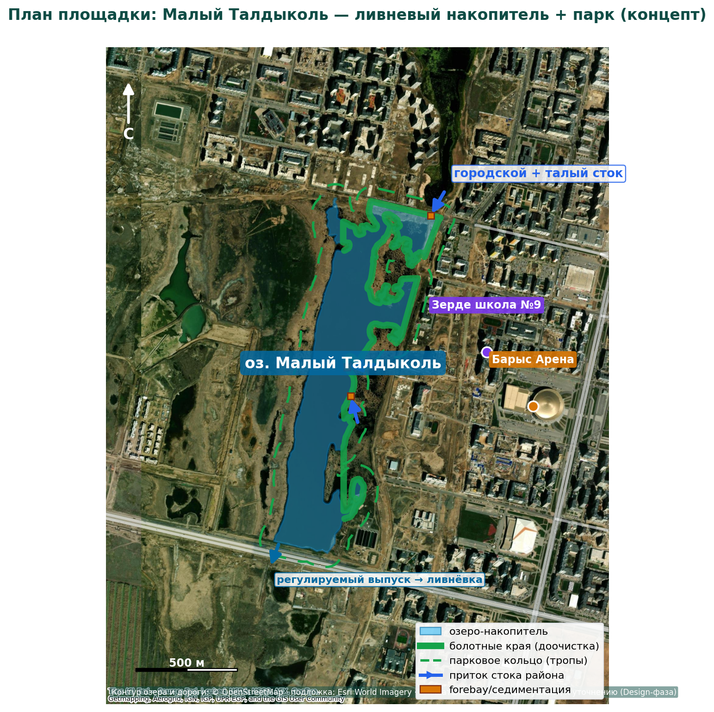

# NBS-IA · Малый Талдыколь
## Ливневый накопитель + водно-болотный парк — пример колоды

---
# Проблема и серый актив
- Ливневая сеть растущего ЮЗ-района перегружена
- Паводки Есиля 2024: >75 тыс. эвакуированных
- КОС-1 на пределе, КОС-2 не построены
    - недоочищенный сток идёт в систему
- Осушённое ложе → пыль и солевые аэрозоли

---
# Решение: природная инфраструктура
- Озеро как накопитель-регулятор: срезка пика стока
- Болотные края: доочистка N / P / взвесей
- Парк: рекреация, птицы, связь со спорткластером
- MRV (C4): измеримый эффект — 30% оценки гранта

---
# Геопривязанный план площадки

- Контур озера из OpenStreetMap, площадь ≈ 46 га
- Привязка вмешательств к реальной геометрии
